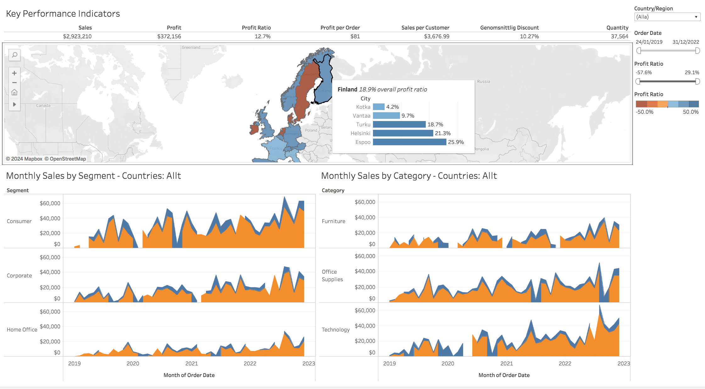
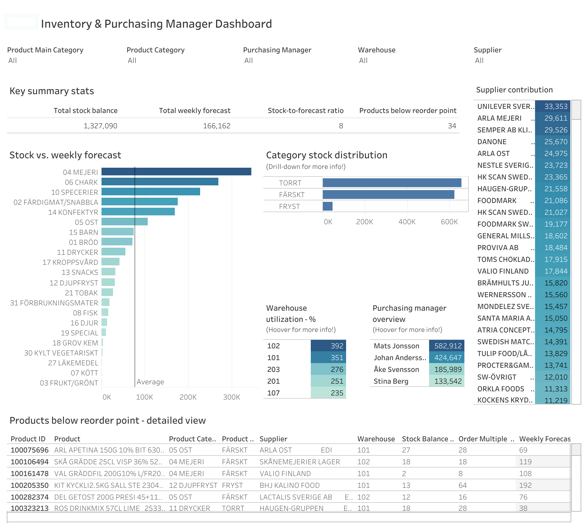
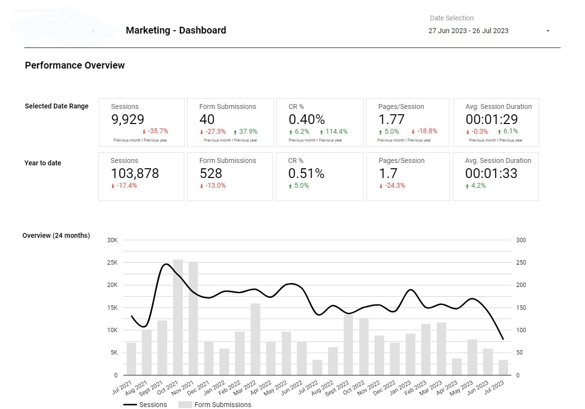

# 📊 Portfolio Visuals

A showcase of dashboards and notebooks demonstrating data visualization and predictive modeling skills using tools like Power BI, Tableau, and Python.

## 🖼️ Dashboards

| Tool     | Description                                | Preview |
|----------|--------------------------------------------|---------|
| Tableau  | Customer Pipeline Dashboard                |  |
| Tableau  | Executive Sales Dashboard                  |  |
| Tableau  | Inventory & Purchasing Manager Dashboard   |  |
| Power BI | LF Stockholm Dashboard                     |  |
| Looker   | Marketing Dashboard                        |  |

## 📄 Predictive Modeling Report

- **Identifying EV Owners** (Retail Strategy)  
  This report showcases a predictive model built to identify potential electric vehicle owners using consumer data and statistical techniques.
📄 [View PDF]https://drive.google.com/file/d/1KIObKcbjO1RopIHToD9bma5aMTkfT4my/view?usp=sharing

